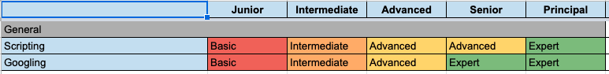

# Task #1: create GitHub repository

Sergey Korol sent me the following email:

> Hi,
> 
> You received this email as you're willing to learn something new.
> 
> However, you perfectly know that willing is not enough, you must do... Do your best to prove yourself you're ready for mastering new skills.
> 
> You'll receive a set of tasks that will show if you're ready to participate in our internal Automated Testing course or need a little bit more time to strengthen some core technical skills before moving forward.
> 
> You probably know that each competence in our company has a special document called Competency Matrix. It lists a set of skills required for reaching the next professional level in your career. Automated Testing vector has no exceptions.
> 
> Let's take a look at the General section.
> 
> 
> 
> As it's impossible to keep everything in one's head, it's very important to have some Googling skills to effectively find and apply the required information in your daily work.
> 
> So here's your first task which should be accomplished on your own:
> 1. Create a personal GitHub account.
> 2. Create your GitHub profile README: introduce yourself and describe why do you want to learn Automated Testing.
> 3. Create your first public repository named "TIL" (which stands for "Today I Learned") with the initial README file and Apache 2.0 license.
> 4. Follow further GitHub instructions to clone your repository locally.
> 5. Organize your repository's folders structure the way it'd be easy to add and group a new material in the future. Feel free to inspire yourself by looking at how others do it. ;)
> 6. Add your first story about what you have learned today into README following markdown (.md) syntax.
> 7. Commit and Push your changes to GitHub.
> 8. Add me (sskorol) as a Collaborator to your repository.
> 
> Deadline: **May 28**.
> 
> You can reply to my corporate email if you don't have enough time or capacity to do this task in time.
> 
> Note that I perfectly understand some of you already do automation on your projects. But anyway, such a repository will help to track your progress and collect a great knowledge base with useful scripts and code snippets.

I have to create and organize my GitHub account and repository.